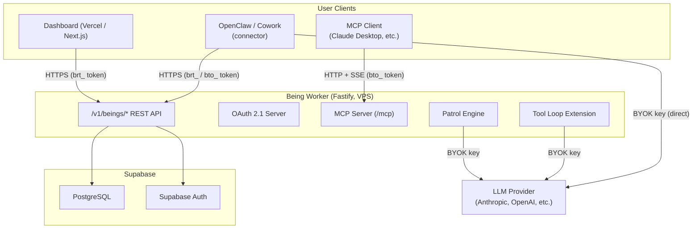

# Architecture Overview

Ruddia is a platform for creating AI beings — persistent AI entities with their own personality, memory, and long-term relationships. Unlike stateless chatbots, a Being continues to think, remember, and evolve between conversations.

## What is a Being?

A Being is a small AI that wraps a large language model. The LLM handles raw text generation; the Being provides everything that makes it a distinct, persistent entity:

- **Personality (SOUL)** — A structured definition of the Being's name, character, voice, values, and inner world. Swapping the SOUL produces a fundamentally different Being, even on the same LLM.
- **Memory** — Episodic memories stored as structured "scenes" (who, what, when, where, and associated emotion). Memories accumulate, decay, merge, and consolidate over time — modeled after human memory.
- **Patrol** — A background maintenance cycle that processes recent conversations into memory nodes, consolidates fading memories, and generates introspective thoughts. This keeps the Being's inner world alive even between sessions.
- **Sense** — Inbound events from connected applications (IoT signals, notifications, external data feeds) that can trigger reactions without a direct user message.
- **Act** — Outbound actions delegated to a connected application (e.g., send a message, run a command). The Being decides; the connector executes.
- **Converse** — The conversational interface. The connector calls `GET /v1/beings/:id/context` to retrieve the Being's current personality and memory snapshot, then runs the LLM locally and calls `POST /v1/beings/:id/patrol/trigger` to commit the conversation to memory.

The key design principle: **Beings think and remember; connectors act.** The Being Worker never directly controls external systems. It processes context and produces outputs that connectors carry out.

## Component Architecture



### Being Worker

A [Fastify](https://fastify.dev/) server (Node.js) running on a VPS. It owns all Being-related state and logic:

- **REST API** — CRUD for Beings, memory operations, patrol triggers, settings, identity, and extensions.
- **OAuth 2.1 Server** — Issues access tokens (`bto_`) that third-party connectors use to access a user's Being.
- **MCP Server** — Exposes a Being as an MCP resource so it can be attached to any MCP-compatible client.
- **Patrol Engine** — Processes conversation messages into memory nodes using a multi-step LLM pipeline.
- **Tool Loop Extension** — Runs an autonomous LLM-driven tool loop (web search, sandbox execution, etc.) against a Being's context.

### Supabase

Handles persistent storage (PostgreSQL) and authentication. The Being Worker uses the Supabase service-role key directly; the dashboard uses the Supabase JS client with row-level security.

Key tables: `beings`, `souls`, `memory_nodes`, `clusters`, `signature_chain`, `oauth_clients`, `oauth_access_tokens`, `being_extensions`.

### Dashboard

A Next.js application deployed on Vercel. It provides the UI for creating and configuring Beings, editing SOUL, managing extensions, and reviewing memory. It communicates with the Being Worker via the Bearer token API.

### Connectors

External applications that integrate with a Being's conversational loop. A connector:

1. Calls `GET /v1/beings/:id/context` to retrieve system prompt, snapshot, notes, and tool definitions.
2. Injects the response into an LLM call (with its own conversation history).
3. Handles tool calls that come back from the LLM.
4. Calls `POST /v1/beings/:id/patrol/trigger` after the conversation turn to commit messages to Being memory.

[OpenClaw](https://openclaw.ai) is the reference connector. Cowork is another.

## Deployment Model

```
User Browser / Client App
        │
        ▼
Vercel (Dashboard, Next.js)
        │  brt_ Bearer token
        ▼
Being Worker VPS (Fastify, port 3100)
        │
        ├── Supabase (PostgreSQL + Auth)
        └── LLM Provider (via BYOK key)
```

The Being Worker is a single-process Fastify server. It does not require horizontal scaling in the current architecture; patrol jobs run as in-process async tasks with a configurable concurrency cap (`MAX_CONCURRENT_JOBS`, default 20).

## BYOK (Bring Your Own Key)

Beings are designed to run on the user's own LLM API key. The dashboard stores the key encrypted in the database; the Being Worker decrypts it at runtime when calling the LLM.

This means:
- The platform never uses API quota on behalf of users without consent.
- Key access is gated by ownership checks — only the Being's owner can trigger LLM calls.
- Free and paid plans both support BYOK.

The header `X-LLM-API-Key` is accepted on several endpoints (e.g., `patrol/trigger`, `memory/conclude`, `memory/auto-recall`) for connectors that manage the key themselves.

## Authentication Overview

The Being Worker uses two token types for `/v1/` endpoints:

| Token prefix | Type | Issued by | Use case |
|---|---|---|---|
| `brt_` | Bearer API token | Dashboard / API | Direct integrations, CLI tools |
| `bto_` | OAuth access token | Being Worker OAuth server | Third-party connectors via OAuth 2.1 |

Both token types are stored as SHA-256 hashes in the database and verified on every request. The worker injects `beingUserId` and `beingScope` into the Fastify request object after authentication.

Public endpoints (identity, OAuth metadata, health check, MCP) skip this middleware.

See [05-being-identity.md](./05-being-identity.md) for cryptographic ownership proofs and [07-oauth.md](./07-oauth.md) for the full OAuth flow.

## Rate Limiting

Global rate limit: **60 requests / minute / IP**. Enforced by `@fastify/rate-limit`. The worker returns HTTP 429 with a `Retry-After` header when the limit is exceeded.

Individual routes may override this limit.

## CORS

The worker allows cross-origin requests from:
- `https://ruddia.com`
- `https://www.ruddia.com`
- `https://being.ruddia.com`

Allowed headers: `Authorization`, `Content-Type`, `X-LLM-API-Key`.
