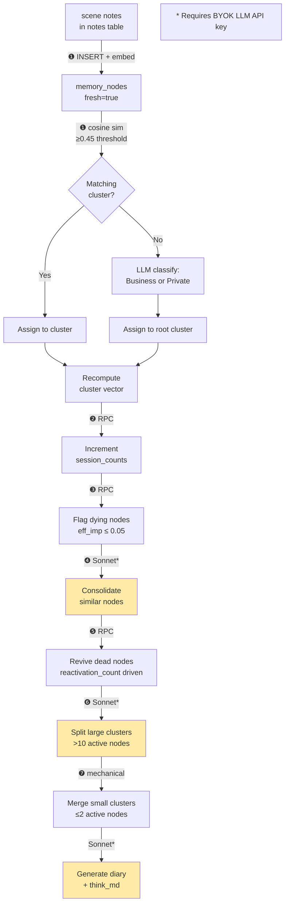

# 04 — Memory & Patrol

This document describes how a Being stores, organises, and refreshes its long-term memory.

---

## Memory Structure

Memory is stored in two layers.

### Layer 1 — `memory_nodes`

Each node represents a single **scene**: one discrete event, decision, emotion, or observation. A node has the following key fields:

| Field | Type | Description |
|-------|------|-------------|
| `id` | UUID | Primary key |
| `scene` | JSONB | Structured scene object (see below) |
| `feeling` | text | First-person subjective impression |
| `importance` | float (0–1) | Current importance score |
| `cluster_id` | UUID | The sub-cluster this node belongs to |
| `themes` | text[] | Theme tags |
| `emotion` | JSONB | VADSNT emotion vector (Valence, Arousal, Dominance, Safety, Novelty, Trust) |
| `session_count` | int | Number of patrol cycles since last activation |
| `status` | text | `active` / `dying` / `dead` |
| `fresh` | bool | True for nodes added this patrol cycle (not yet consolidated) |
| `pinned` | bool | Pinned nodes are never decayed |
| `reactivation_count` | int | Incremented when the node is recalled; drives revival from `dead` |
| `last_activated` | timestamptz | When the node was last accessed via recall |

### Layer 2 — `clusters`

Clusters group thematically related nodes. There are two levels:

| Level | Description |
|-------|-------------|
| **Root clusters** (`is_parent=true`) | `Business` and `Private` — top-level buckets. Self-referential `parent_id`. Never split by patrol. |
| **Sub-clusters** | Topic-specific groups, e.g. "Friday evening dinner". Have a `parent_id` pointing to a root cluster. |

Each cluster stores a `vector` (float8[], 256-dim) that is the average embedding of its active nodes' `action` texts. This vector powers cosine-similarity search.

---

## Scene Format

A scene is stored as a JSONB object. The canonical fields are:

```typescript
interface Scene {
  action: string      // What happened (required — primary clustering key)
  actors: string[]    // Who was involved (required)
  when: string[]      // Dates as YYYY-MM-DD (required)
  setting?: string    // Where / context
  dialogue?: string[] // Notable quotes
  sensory?: string[]  // Sensory details
}
```

The `feeling` field is stored separately alongside the scene (a top-level column), not inside the JSONB object.

**Human-readable rendering** (`sceneToText`):
```
YYYY-MM-DD — setting — action — "first dialogue line" — (feeling)
```

---

## Context Structure

When building a conversation context, three blocks are assembled:

### Block 1-A — `system_prompt`

The stable persona definition injected as the system prompt. Contains:
- Soul definition (personality, voice, values, backstory, inner world, examples)
- `think_md` (patrol-generated reflection notes from the previous cycle)
- Partner rules (enabled rules from `partner_rules` table)
- User preferences
- Relationship entries
- Partner tools
- Partner map entries

Recommended to cache as a prompt prefix. Changes only when the SOUL is manually edited.

### Block 1-B — `snapshot`

A semi-stable memory snapshot injected as a user+assistant prefix message pair at the beginning of the conversation. Contains:
- Unread notes (TODOs, reminders)
- Knowledge entries
- Diary entries (recent 7 days)

Changes on note/preference/relationship updates.

### Block 2-B — `recent_nodes`

The 5 most recently activated memory nodes (filtered to nodes with a valid `action`). Injected dynamically each turn.

---

## Patrol Pipeline

The patrol pipeline (`runGraphMigration` in `graph.ts`) converts accumulated scene notes into consolidated `memory_nodes`. It runs in the background, either triggered automatically or on demand.



### Step-by-Step Description

#### ❶ Scene notes → `memory_nodes` + cluster assignment

1. Reads all `type='scene'` entries from the `notes` table for this Being.
2. Parses each as a `SceneInput` JSON object. Parse failures are marked `[PARSE_FAILED]` and retained for LLM self-repair.
3. Inserts valid scenes as new `memory_nodes` with `fresh=true` and `importance = clamp(0, 1, scene.importance ?? 0.5)`.
4. Embeds all `action` texts in a single OpenAI `text-embedding-3-small` API call (256 dimensions).
5. For each node, calls `match_clusters` RPC with `threshold=0.45`. If a matching cluster exists, assigns the node to it. If not, uses a Haiku LLM call to classify the action as `Business` or `Private` and falls back to the corresponding root cluster.
6. Recomputes the vector for every affected cluster.

#### ❷ Increment session counts

RPC `increment_session_counts` — adds 1 to `session_count` for every active node belonging to this user. Used to compute effective time for decay.

#### ❸ Flag dying nodes

RPC `flag_dying_nodes` — sets `status = 'dying'` for nodes whose effective importance falls at or below 0.05:

```
eff_imp = importance × exp(−session_count / 30)
```

Nodes with `pinned=true` are excluded.

#### ❹ Consolidation — LLM required (Sonnet)

Runs only when a BYOK API key is available.

For each cluster containing `fresh` or `dying` nodes, sends the full node list to Claude Sonnet with a consolidation prompt. Sonnet identifies:

- **Merge pairs**: semantically duplicate or complementary nodes → the "survivor" absorbs the others. Survivor's `importance` increases by 0.05 (capped at 1.0); absorbed nodes become `dead`.
- **make_dead list**: dying nodes with no merge partner → set to `dead` immediately.

Fresh nodes that are not merged have their `fresh` flag reset to `false`.

#### ❺ Revive dead nodes

RPC `revive_dead_nodes` — checks all `dead` nodes. A node is revived to `active` when:
```
eff_imp = importance × exp(−session_count / 30) > 0.05
```
This condition can be satisfied after `recall` increments `reactivation_count` (by +1 via `recall` tool, or by +2 when browsing via `recall_memory`).

#### ❻ Cluster splitting — LLM required (Sonnet)

Runs only when a BYOK API key is available.

Checks every sub-cluster with more than 10 active nodes. Sends the node list to Sonnet asking for a semantic split. Each proposed split must have ≥ 2 nodes; at least 2 nodes must remain in the original cluster. New sub-clusters are created with the same `parent_id` as the original.

Root clusters (`is_parent=true`) are never split.

#### ❼ Small cluster consolidation — mechanical

Iterates every sub-cluster with ≤ 2 active nodes:

1. **Empty clusters** (0 nodes total including dead): deleted.
2. **Non-empty small clusters**: find the sibling sub-cluster with the highest cosine similarity. If `similarity > 0.45`, move all nodes (including dead) to that sibling. Otherwise, move nodes to the parent cluster (root). Delete the now-empty small cluster (unless it has child clusters).

#### Diary + `think_md` generation — LLM required (Sonnet)

After ❼, if there are any scene notes and a BYOK key is available:

- **Diary**: A 3–5 line reflection written from the Being's perspective, upserted into the `diary` table for today's date.
- **think_md**: 3–7 bullet-point notes on what the Being noticed or wants to remember for the next session. Written to `souls.think_md` for the partner type. Injected into Block 1-A at next conversation start.

---

## Without BYOK

When no LLM API key is configured (neither in the request header nor in the database):

- Steps ❹ (consolidation) and ❻ (cluster splitting) are **skipped entirely**.
- Diary and `think_md` generation are also **skipped**.
- Steps ❶, ❷, ❸, ❺, ❼ run normally (mechanical/RPC operations).

The log message at this point is:
```
[graph] BYOK key not set: skipping ❹❻ diary/think_md (mechanical processing only)
```

---

## Recall Flow

Every time `recall` is called (either via MCP or internally during chat):

1. The user message is embedded with `text-embedding-3-small`.
2. `findSimilarClusters` RPC (`match_clusters`) is called with `threshold=0.35`, returning up to 5 matching clusters.
3. For each matched cluster, the top 3 active nodes (ordered by `importance` desc) are fetched.
4. `reactivation_count` on those nodes is incremented by 1.
5. Results are returned wrapped in a `<memory-recall>` block:

```xml
<memory-recall>
[ClusterName] cluster digest text
- when — setting — action — (feeling)
- ...

[AnotherCluster] ...
</memory-recall>
```

If no clusters match, the tool returns an empty result (no tag).

When `recall_memory` is called explicitly with a `cluster_id`, dead nodes in the result have their `reactivation_count` incremented by 2 (more aggressive revival signal).
