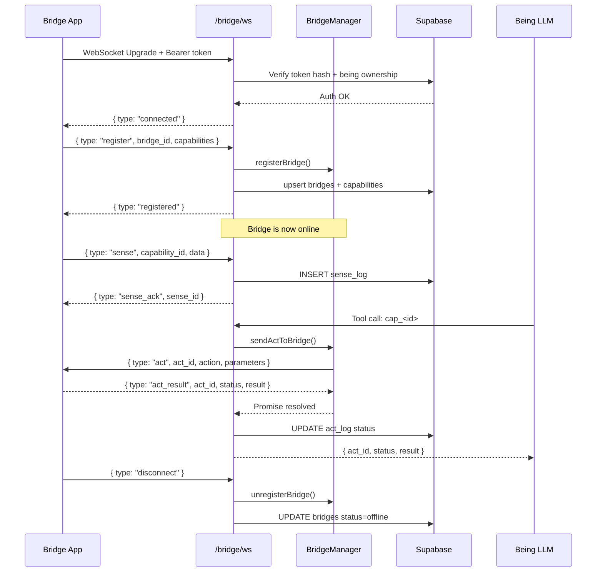

# 06 — Sense-Act Bridge

## Concept

A Being is an AI mind without a body. The **Bridge** layer gives it access to the physical world by lending capabilities from connected devices or apps — sensors (sense) and actuators (act). The Being itself never runs on the device; it calls capability tools and the Bridge executes them locally.

This design means:
- Beings can perceive and act across phones, computers, smart home devices, etc.
- Device integration code lives entirely outside the Being Worker.
- Adding new capabilities doesn't require changes to the Being's core.

---

## WebSocket Endpoint

```
GET /v1/beings/:being_id/bridge/ws
Upgrade: websocket
```

The Bridge App (mobile app, desktop agent, IoT hub, etc.) opens a persistent WebSocket connection here. Authentication is via Bearer token in the `Authorization` header or `?token=` query parameter.

### Authentication Flow

1. Bridge connects with `Authorization: Bearer brt_xxxxxxx` (or `?token=brt_xxx`).
2. Server looks up the token hash in `being_api_tokens`.
3. Server verifies that the requested `being_id` belongs to the token's owner (`beings.owner_id`).
4. On success, the server sends:
   ```json
   { "type": "connected", "message": "Authenticated. Send register message." }
   ```
5. On failure, the socket is closed with code `1008 Unauthorized`.

---

## Message Protocol

All messages are JSON-encoded.

### Bridge → Server

#### `register`

Must be the first message after connection. Declares the Bridge's identity and its capabilities.

```json
{
  "type": "register",
  "bridge_id": "my-phone-bridge",
  "bridge_name": "Alice's iPhone",
  "capabilities": [
    {
      "id": "cap-camera-001",
      "type": "sense",
      "name": "Camera",
      "description": "Take a photo with the front camera",
      "data_type": "image/jpeg"
    },
    {
      "id": "cap-speaker-001",
      "type": "act",
      "name": "Speaker",
      "description": "Play audio through the speaker",
      "actions": ["play", "stop", "set_volume"]
    }
  ]
}
```

Server responds:
```json
{ "type": "registered", "bridge_id": "my-phone-bridge", "capabilities_count": 2 }
```

Internally, this upserts a row in `bridges` (status=`online`) and upserts all capabilities in the `capabilities` table.

#### `sense`

Push sensor/device data to the Worker. The data is saved to `sense_log`.

```json
{
  "type": "sense",
  "capability_id": "cap-camera-001",
  "data": { "image_url": "https://...", "timestamp": "2026-04-14T12:00:00Z" }
}
```

Server responds:
```json
{ "type": "sense_ack", "sense_id": "<uuid>" }
```

#### `act_result`

Return the outcome of an act command that was previously sent by the server.

```json
{
  "type": "act_result",
  "act_id": "<uuid>",
  "status": "completed",
  "result": { "volume_set": 70 }
}
```

| `status` | Meaning |
|----------|---------|
| `completed` | Action succeeded |
| `failed` | Action failed (include error in `result`) |

#### `disconnect`

Graceful shutdown.

```json
{ "type": "disconnect" }
```

#### `pong`

Response to a server-initiated ping (heartbeat, every 30 seconds).

```json
{ "type": "pong" }
```

### Server → Bridge

#### `ping` (heartbeat)
```json
{ "type": "ping" }
```

#### `act` (action command)

Sent when the Being's LLM invokes a capability tool.

```json
{
  "type": "act",
  "act_id": "<uuid>",
  "capability_id": "cap-speaker-001",
  "action": "play",
  "parameters": { "url": "https://audio.example.com/track.mp3" }
}
```

The Bridge must execute the action and return an `act_result` message. Default timeout: **5 seconds**. Timeout produces status `timeout` on the server side.

---

## Capability Registration

Capabilities can also be registered via REST (without an active WebSocket):

```
POST /v1/beings/:being_id/capabilities/register
Authorization: Bearer <token>
Content-Type: application/json

{
  "bridge_id": "my-phone-bridge",
  "bridge_name": "Alice's iPhone",
  "capabilities": [ ... ]
}
```

### Capability Object Schema

| Field | Type | Description |
|-------|------|-------------|
| `id` | `string` | Unique capability identifier |
| `type` | `'sense' \| 'act'` | Sensor input or actuator output |
| `name` | `string` | Human-readable name |
| `description` | `string` | What this capability does |
| `actions` | `string[]` | Enumerated actions (for `act` type) |
| `data_type` | `string` | MIME type of sense data (for `sense` type) |
| `target_device` | `string` | Target device identifier (optional) |
| `config` | `object` | Additional freeform configuration |

---

## Sense Input via REST

### POST `/v1/beings/:being_id/sense`

Push sense data from external clients (game engines, HTTP-only devices, etc.) without a WebSocket connection.

```
POST /v1/beings/:being_id/sense
Authorization: Bearer <token>
Content-Type: application/json

{
  "capability_id": "cap-camera-001",
  "data": {
    "image_url": "https://...",
    "timestamp": "2026-04-17T12:00:00Z"
  }
}
```

- `capability_id` must exist in the `capabilities` table with `type='sense'` and belong to the authenticated user. Invalid IDs return `400`.
- `data` is stored as-is in `sense_log`. Any JSON object is accepted.
- The `processed` flag is initially `false`; it is flipped to `true` when `get_context` fetches the row.

**Response (201):**
```json
{
  "sense_id": "<uuid>",
  "capability_id": "cap-camera-001",
  "processed": false
}
```

### GET `/v1/beings/:being_id/sense/history`

```
GET /v1/beings/:being_id/sense/history
Authorization: Bearer <token>
```

Query parameters:
- `limit` — max entries (default 20, max 100)
- `capability_id` — filter by capability

Returns:
```json
{
  "history": [
    {
      "id": "<uuid>",
      "capability_id": "cap-camera-001",
      "bridge_id": "my-phone-bridge",
      "data": { ... },
      "processed": false,
      "created_at": "2026-04-14T12:00:00Z"
    }
  ],
  "total": 1
}
```

---

## Listing Active Capabilities

```
GET /v1/beings/:being_id/capabilities
Authorization: Bearer <token>
```

Returns only capabilities from **currently connected** (online) Bridges:

```json
{
  "capabilities": [ ... ],
  "connected_bridges": [
    {
      "bridge_id": "my-phone-bridge",
      "bridge_name": "Alice's iPhone",
      "connected_at": "2026-04-14T11:55:00Z"
    }
  ]
}
```

---

## Act Queue — Pending / Approve / Reject

When the MCP client calls an `act_*` tool but the Bridge is **not connected**, the action is queued in `act_queue` with `status='pending'` instead of being sent immediately.

External clients can inspect and resolve queued actions via REST:

### GET `/v1/beings/:being_id/act/pending`

```
GET /v1/beings/:being_id/act/pending
Authorization: Bearer <token>
```

Returns all actions waiting for Bridge execution:

```json
{
  "actions": [
    {
      "id": "<uuid>",
      "capability_id": "cap-speaker-001",
      "bridge_id": "my-phone-bridge",
      "action_type": "play",
      "action_payload": { "url": "https://..." },
      "status": "pending",
      "created_at": "2026-04-17T12:00:00Z"
    }
  ]
}
```

### POST `/v1/beings/:being_id/act/pending/approve`

Mark a queued action as approved (user or Bridge confirms execution):

```
POST /v1/beings/:being_id/act/pending/approve
Authorization: Bearer <token>
Content-Type: application/json

{ "action_id": "<uuid>" }
```

Updates `act_queue.status` to `'approved'` and sets `resolved_at`. Returns `{ ok: true, action: { ... } }`.

### POST `/v1/beings/:being_id/act/pending/reject`

Reject a queued action:

```
POST /v1/beings/:being_id/act/pending/reject
Authorization: Bearer <token>
Content-Type: application/json

{ "action_id": "<uuid>" }
```

Updates `act_queue.status` to `'rejected'` and sets `resolved_at`. Returns `{ ok: true, action: { ... } }`.

> **Note:** Automatic execution of approved actions when the Bridge reconnects is out of scope for this release and will be addressed in a follow-up issue.

---

## Act Mechanism

When the Being's LLM calls a capability tool (e.g. `cap_<id>`):

1. `handleActTool` is called with `capability_id`, `bridge_id`, `action`, and `parameters`.
2. A row is inserted in `act_log` with `status='pending'`.
3. `sendActToBridge` looks up the in-memory `sessions` map for the Bridge's WebSocket.
4. The `act` message is sent over the WebSocket. A `Promise` is registered in `pendingActs`.
5. When the Bridge sends `act_result`, `resolveActResult` resolves the Promise.
6. `act_log` is updated with the final status and result.
7. The tool returns JSON: `{ act_id, status, result }`.

If the Bridge disconnects before responding, all pending acts for that Bridge are resolved with `status='timeout'`.

---

## `capability_tools` — Capabilities as LLM Tools

When `get_context` is called via MCP, any `act`-type capabilities from connected Bridges are listed in `capability_tools`. This allows the LLM client to include them as additional tools in its next turn.

During standard chat processing (`process-job.ts`), `getActiveCapabilityTools` queries the `capabilities` table for capabilities whose `bridges.status = 'online'`, and converts each to an Anthropic-format tool definition:

- **Tool name**: `cap_<capability_id>` (non-alphanumeric chars replaced with `_`)
- **Description**: `"<capability description> （<bridge name> / 行動 or 知覚）"`
- **Input schema**: For `act` type with `actions` array, exposes an `action` enum parameter plus optional `parameters` object. For custom schemas, uses `config.input_schema`. For `sense` type, exposes no parameters.

The system prompt also includes a `## 接続中のBridgeとcapability` section listing all act and sense tools.

---

## Sequence Diagram


