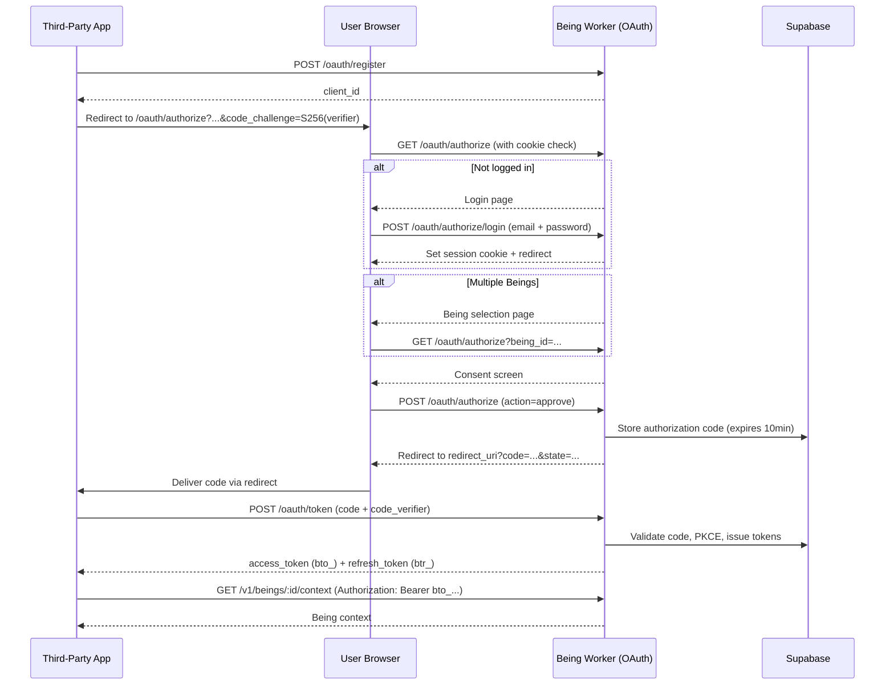

# OAuth 2.1

The Being Worker implements an OAuth 2.1 authorization server. This lets third-party applications (connectors, tools, integrations) access a user's Being on their behalf — without the user sharing their raw API token.

## Why OAuth?

Bearer API tokens (`brt_`) are powerful but inflexible: they grant full access and don't expire. When a third-party application (e.g., a custom connector, a community-built tool) needs access to a Being, OAuth provides:

- **Scoped authorization** — the user explicitly grants access to a specific Being.
- **Short-lived tokens** — access tokens expire after 1 hour; refresh tokens after 30 days.
- **Token rotation** — each refresh issues new tokens; reuse of a revoked refresh token triggers full revocation.
- **User consent** — a browser-based consent screen; the third party never sees the user's password or API token.

## Token Types

| Prefix | Type | TTL | Description |
|--------|------|-----|-------------|
| `bto_` | OAuth access token | 1 hour | Grants API access. Stored as SHA-256 hash. |
| `btr_` | OAuth refresh token | 30 days | Used to obtain a new access token. Stored as SHA-256 hash. |

Both raw tokens are returned only at issuance time and never stored in plaintext.

## Discovery

### `GET /.well-known/oauth-authorization-server`

RFC 8414 Authorization Server Metadata.

```bash
curl https://being.ruddia.com/.well-known/oauth-authorization-server
```

```json
{
  "issuer": "https://being.ruddia.com",
  "authorization_endpoint": "https://being.ruddia.com/oauth/authorize",
  "token_endpoint": "https://being.ruddia.com/oauth/token",
  "registration_endpoint": "https://being.ruddia.com/oauth/register",
  "scopes_supported": ["being:full"],
  "response_types_supported": ["code"],
  "grant_types_supported": ["authorization_code", "refresh_token"],
  "code_challenge_methods_supported": ["S256"],
  "token_endpoint_auth_methods_supported": ["none"],
  "resource_indicators_supported": true
}
```

### `GET /.well-known/oauth-protected-resource`

RFC 9728 Protected Resource Metadata.

```json
{
  "resource": "https://being.ruddia.com",
  "authorization_servers": ["https://being.ruddia.com"],
  "bearer_methods_supported": ["header"],
  "scopes_supported": ["being:full"],
  "resource_documentation": "https://docs.ruddia.com/api"
}
```

## Dynamic Client Registration

Third-party applications register themselves before initiating a flow. No prior approval is required.

### `POST /oauth/register`

RFC 7591 Dynamic Client Registration.

**Request body:**
```json
{
  "client_name": "My Connector",
  "redirect_uris": ["https://myapp.example.com/callback"],
  "grant_types": ["authorization_code"],
  "token_endpoint_auth_method": "none",
  "scope": "being:full"
}
```

| Field | Required | Notes |
|-------|----------|-------|
| `client_name` | Yes | Display name shown in the consent screen. |
| `redirect_uris` | Yes | At least one URI. Must be an exact match during authorization. |
| `grant_types` | No | Defaults to `["authorization_code"]`. Must include `"authorization_code"`. |
| `token_endpoint_auth_method` | No | Must be `"none"` (public clients only). |
| `scope` | No | Defaults to `"being:full"`. Currently the only supported scope. |

**Response:** `201 Created`
```json
{
  "client_id": "cid_<uuid>",
  "client_name": "My Connector",
  "redirect_uris": ["https://myapp.example.com/callback"],
  "grant_types": ["authorization_code"],
  "response_types": ["code"],
  "token_endpoint_auth_method": "none",
  "scope": "being:full",
  "client_id_issued_at": 1713088800
}
```

> No `client_secret` is issued. All clients are public clients (PKCE is mandatory).

### `GET /oauth/clients/:client_id`

Retrieve metadata for a registered client (RFC 7591 Client ID Metadata Document).

---

## Authorization Flow



### Step 1: Generate PKCE Parameters

PKCE (S256) is **required**. There is no fallback to plain.

```javascript
// Generate code_verifier (43-128 characters, URL-safe)
const verifier = crypto.randomBytes(32).toString('base64url')  // 43 chars

// Compute code_challenge
const challenge = crypto.createHash('sha256').update(verifier).digest('base64url')
```

### Step 2: Authorization Request

Redirect the user's browser to:

```
GET https://being.ruddia.com/oauth/authorize
  ?response_type=code
  &client_id=cid_<uuid>
  &redirect_uri=https://myapp.example.com/callback
  &scope=being:full
  &code_challenge=<base64url-sha256-of-verifier>
  &code_challenge_method=S256
  &state=<random-state>
  &being_id=<optional-being-id>
```

| Parameter | Required | Description |
|-----------|----------|-------------|
| `response_type` | Yes | Must be `"code"`. |
| `client_id` | Yes | Obtained from DCR. |
| `redirect_uri` | Yes | Must match a registered URI exactly. |
| `scope` | Yes | Must include `"being:full"`. |
| `code_challenge` | Yes | `BASE64URL(SHA-256(code_verifier))`. |
| `code_challenge_method` | Yes | Must be `"S256"`. |
| `state` | Recommended | Opaque value to prevent CSRF; returned in the redirect. |
| `being_id` | Optional | Pre-selects a specific Being. If omitted and the user has multiple Beings, a selection screen is shown. If the user has exactly one Being, it is selected automatically. |
| `resource` | Optional | MCP resource URI (e.g., `https://being.ruddia.com/mcp/<being_id>`). The `being_id` is extracted if not explicitly provided. |

The authorization server shows:
1. A **login page** if the user is not authenticated.
2. A **Being selection page** if `being_id` is not specified and the user has multiple Beings.
3. A **consent screen** listing the requested scope and the selected Being.

### Step 3: Authorization Code Callback

On approval, the user's browser is redirected to:

```
https://myapp.example.com/callback?code=<code>&state=<state>
```

The authorization code is **single-use** and expires after **10 minutes**.

On denial: `?error=access_denied&state=<state>`.

### Step 4: Token Exchange

```bash
curl -X POST https://being.ruddia.com/oauth/token \
  -H "Content-Type: application/x-www-form-urlencoded" \
  -d "grant_type=authorization_code" \
  -d "code=<code>" \
  -d "redirect_uri=https://myapp.example.com/callback" \
  -d "client_id=cid_<uuid>" \
  -d "code_verifier=<verifier>"
```

**Response:**
```json
{
  "access_token": "bto_...",
  "token_type": "Bearer",
  "expires_in": 3600,
  "refresh_token": "btr_...",
  "scope": "being:full"
}
```

The `access_token` is valid for **1 hour**. Store the `refresh_token` securely.

### Step 5: API Access

```bash
curl https://being.ruddia.com/v1/beings/<being_id>/context \
  -H "Authorization: Bearer bto_..."
```

The `bto_` token is bound to a specific Being (the one selected during authorization). It can only access that Being's endpoints.

---

## Token Refresh

When the access token expires, use the refresh token to obtain a new pair:

```bash
curl -X POST https://being.ruddia.com/oauth/token \
  -H "Content-Type: application/x-www-form-urlencoded" \
  -d "grant_type=refresh_token" \
  -d "refresh_token=btr_..." \
  -d "client_id=cid_<uuid>"
```

**Response:** Same format as token exchange — new `access_token` and new `refresh_token`.

**Token rotation:** Each refresh issues a new refresh token and revokes the old one. The old refresh token cannot be reused.

### Replay Attack Protection

If a revoked refresh token is presented, the server immediately revokes **all** access and refresh tokens for that user + client pair and returns `400 invalid_grant`. This prevents token replay attacks after a token leak.

---

## Scope

Currently only one scope is supported:

| Scope | Description |
|-------|-------------|
| `being:full` | Full read/write access to the authorized Being. |

---

## Complete Example (curl)

```bash
# 1. Register client
CLIENT=$(curl -s -X POST https://being.ruddia.com/oauth/register \
  -H "Content-Type: application/json" \
  -d '{
    "client_name": "My App",
    "redirect_uris": ["https://myapp.example.com/callback"]
  }')
CLIENT_ID=$(echo $CLIENT | jq -r .client_id)

# 2. Generate PKCE
VERIFIER=$(openssl rand -base64 32 | tr -d '=+/' | head -c 43)
CHALLENGE=$(echo -n "$VERIFIER" | openssl dgst -sha256 -binary | openssl base64 -A | tr '+/' '-_' | tr -d '=')

# 3. Direct the user's browser to:
echo "https://being.ruddia.com/oauth/authorize?response_type=code&client_id=$CLIENT_ID&redirect_uri=https://myapp.example.com/callback&scope=being%3Afull&code_challenge=$CHALLENGE&code_challenge_method=S256&state=random123"
# => User logs in, selects Being, approves
# => Browser redirects to: https://myapp.example.com/callback?code=<CODE>&state=random123

# 4. Exchange code for tokens (replace <CODE> with actual code)
TOKENS=$(curl -s -X POST https://being.ruddia.com/oauth/token \
  -H "Content-Type: application/x-www-form-urlencoded" \
  -d "grant_type=authorization_code&code=<CODE>&redirect_uri=https://myapp.example.com/callback&client_id=$CLIENT_ID&code_verifier=$VERIFIER")
ACCESS_TOKEN=$(echo $TOKENS | jq -r .access_token)
REFRESH_TOKEN=$(echo $TOKENS | jq -r .refresh_token)

# 5. Call the API
curl https://being.ruddia.com/v1/beings/<being_id>/context \
  -H "Authorization: Bearer $ACCESS_TOKEN"

# 6. Refresh when expired
NEW_TOKENS=$(curl -s -X POST https://being.ruddia.com/oauth/token \
  -H "Content-Type: application/x-www-form-urlencoded" \
  -d "grant_type=refresh_token&refresh_token=$REFRESH_TOKEN&client_id=$CLIENT_ID")
```

---

## MCP Integration

MCP clients (e.g., Claude Desktop) can authorize via OAuth using the `resource` parameter to pre-identify the Being:

```
GET /oauth/authorize?...&resource=https://being.ruddia.com/mcp/<being_id>
```

The server extracts the `being_id` from the resource URI path and pre-selects the Being, skipping the selection screen.

See the authorization server metadata's `resource_indicators_supported: true` for the relevant RFC (RFC 8707).
