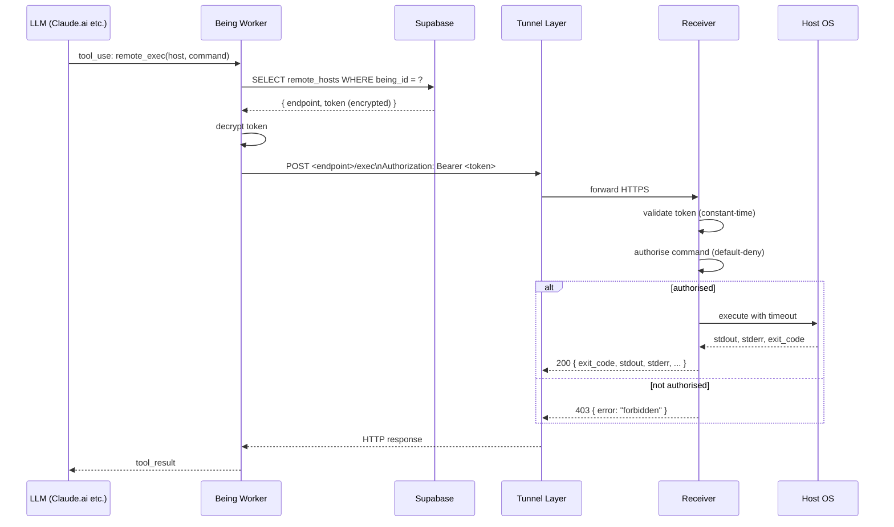

# 09 — Being Remote Exec

## Concept

**Remote Exec** lets a Being execute commands on a user-owned host (VPS, NAS, home server) over HTTPS. It exists because LLM client sandboxes (Claude.ai, Mistral Le Chat, Grok, etc.) only allow HTTP(S) egress — `ssh` is unreachable from these environments regardless of allowlist tweaks.

The feature is **opt-in for developer / hobbyist users** who want to operate their own infrastructure from their Being partner. It is not enabled by default and is not required for any other Being feature.

The design separates three concerns:

- **Being side** — stores which host to send what to (`partner_tools.remote_hosts`) and exposes the `remote_exec` tool. Owns no tunnel or auth infrastructure.
- **Receiver** — a generic HTTP daemon running on the user's host. It listens on loopback, executes whitelisted commands, and authenticates with bearer tokens. The reference implementation is written in Go and distributed by Being (see issue #7 for naming and packaging).
- **Tunnel layer** — user's choice (Cloudflare Tunnel, Tailscale Funnel, frp, self-hosted Caddy + Basic Auth, etc.). Being side does not dictate the tunnel shape; HTTPS reachability + bearer token is the only contract.

This means a user can pick whatever tunnel fits their threat model, and Being only ever talks to a stable HTTPS endpoint.

---

## Endpoint Reference

The receiver exposes two endpoints. Binding to loopback and external reachability are the operator's and tunnel layer's responsibilities.

### `POST /exec`

Execute one whitelisted command and return its output.

**Request:**

```http
POST /exec HTTP/1.1
Host: vps.example.com
Authorization: Bearer <token>
Content-Type: application/json

{
  "command": "systemctl status nginx",
  "timeout_ms": 10000,
  "stdin": ""
}
```

| Field | Type | Required | Description |
|-------|------|----------|-------------|
| `command` | `string` | yes | Full command string. Must be authorised by the receiver's allowlist. |
| `timeout_ms` | `integer` | no | Per-call timeout in milliseconds. If omitted, the Being-side tool handler uses `default_timeout_ms` from `partner_tools.remote_hosts`. If that is also absent, the receiver MUST apply its own default (implementation-defined, SHOULD be documented). The receiver MAY enforce an upper bound regardless of the requested value. |
| `stdin` | `string` | no | Standard input piped to the command. Default empty. |

**Response (200):**

```json
{
  "exit_code": 0,
  "stdout": "● nginx.service - A high performance web server ...",
  "stderr": "",
  "duration_ms": 87,
  "truncated": false
}
```

| Field | Type | Description |
|-------|------|-------------|
| `exit_code` | `integer` | Process exit code. |
| `stdout` | `string` | UTF-8 stdout, possibly truncated by the receiver. |
| `stderr` | `string` | UTF-8 stderr, same truncation rule. |
| `duration_ms` | `integer` | Wall-clock duration in milliseconds. |
| `truncated` | `boolean` | `true` if either stream was truncated. MVP returns a single boolean; future versions MAY report per-stream truncation. |

**Error responses:**

| Status | `error` value | Meaning |
|--------|---------------|---------|
| `400` | `invalid_request` | Body does not parse, or `command` is empty. |
| `401` | `unauthorized` | Missing or invalid bearer token. |
| `403` | `forbidden` | Command is not authorised by the allowlist. |
| `408` | `timeout` | Command exceeded `timeout_ms`. Partial `stdout`/`stderr` MAY still be returned. |
| `500` | `internal_error` | Unexpected failure (process spawn error, etc.). |

Error body shape:

```json
{
  "error": "forbidden",
  "message": "command is not authorised"
}
```

### `GET /health`

Liveness probe. No authentication required.

**Response (200):**

```json
{
  "status": "ok",
  "version": "<receiver-version>"
}
```

The receiver MAY include additional fields (uptime, etc.). Clients MUST tolerate unknown fields.

> **Note:** When the receiver is exposed via a tunnel, `/health` is reachable without bearer authentication. The `version` field may reveal the receiver version to unauthenticated callers. Operators SHOULD consider restricting `/health` behind tunnel-level authentication (e.g. Cloudflare Access) or omitting `version` in production deployments.

---

## Authentication

The receiver uses **bearer tokens** in MVP. Tokens are configured server-side (not Being-issued), and Being stores per-host tokens in `partner_tools.remote_hosts`.

- The `Authorization: Bearer <token>` header is required on `/exec`.
- Receivers SHOULD support multiple concurrent tokens to enable rotation.
- Token comparison MUST be constant-time.
- The receiver MUST NOT log the token value.

**HMAC signing and mTLS are out of scope for MVP and deferred to v1.** See _Out of Scope_.

---

## Authorisation Model

Command authorisation follows **default-deny**: a request is rejected with `403 forbidden` unless the receiver explicitly authorises it.

The mechanism by which a receiver authorises a command is implementation-defined. The reference implementation uses anchored regular expressions over the full command string, with shell expansion off by default. Other receivers MAY use different schemes (explicit subcommand whitelists, capability tokens, etc.) as long as the default is deny.

**Required guarantees from any conformant receiver:**

- Empty / missing allowlist MUST block every command.
- Authorisation decisions MUST be made before the command is executed.
- The receiver MUST NOT invoke a user login shell unless the operator has explicitly opted in for that command.
- Inherited environment variables MUST be limited to an explicit allowlist.

The reference receiver's config schema and allowlist semantics are documented separately in the receiver's own docs (see issue #10).

---

## Being-side `remote_exec` Tool

The Being MCP Server exposes one tool, `remote_exec`, when the calling Being has at least one entry in `partner_tools.remote_hosts`.

**Tool definition (Anthropic format):**

```json
{
  "name": "remote_exec",
  "description": "Execute a shell command on a user-owned remote host registered in partner_tools.remote_hosts.",
  "input_schema": {
    "type": "object",
    "required": ["host", "command"],
    "properties": {
      "host": {
        "type": "string",
        "description": "host_id from partner_tools.remote_hosts."
      },
      "command": {
        "type": "string",
        "description": "Full command string. Must be authorised by the receiver's allowlist."
      },
      "timeout_ms": {
        "type": "integer",
        "description": "Per-call timeout in milliseconds. Receivers may enforce their own upper bound."
      },
      "stdin": {
        "type": "string",
        "description": "Standard input piped to the command."
      }
    }
  }
}
```

**Execution flow:**

1. The tool handler looks up `host` in the calling Being's `partner_tools.remote_hosts`. Unknown `host_id` returns an error to the LLM without making a network call.
2. The handler resolves the host's `endpoint` and `token`, then issues `POST <endpoint>/exec` with the user's `command`.
3. The HTTP response is returned to the LLM verbatim as the tool result, augmented with the `host` field for traceability.
4. Network errors (DNS failure, connection refused, TLS error) are surfaced as a tool error with a short reason string. Token values are never echoed.

**Result shape returned to the LLM (success):**

```json
{
  "host": "<host_id>",
  "exit_code": 0,
  "stdout": "...",
  "stderr": "",
  "duration_ms": 87,
  "truncated": false
}
```

**Result shape returned to the LLM (error):**

```json
{
  "host": "<host_id>",
  "error": "forbidden",
  "message": "command is not authorised"
}
```

---

## `partner_tools.remote_hosts` Schema

`remote_hosts` is an array entry under `partner_tools` (see spec 02 — Being API Reference). Each entry describes one receiver reachable over HTTPS.

```json
{
  "remote_hosts": [
    {
      "host_id": "akisa-vps",
      "label": "Akisa's main VPS",
      "endpoint": "https://vps.example.com",
      "token": "<bearer token>",
      "default_timeout_ms": 30000,
      "notes": "Production VPS. journalctl + systemctl status only."
    }
  ]
}
```

| Field | Type | Required | Description |
|-------|------|----------|-------------|
| `host_id` | `string` | yes | Stable identifier referenced by `remote_exec.host`. Unique per Being. |
| `label` | `string` | no | Human-readable name for UI. |
| `endpoint` | `string` | yes | Base HTTPS URL of the receiver. `/exec` is appended by the tool handler. |
| `token` | `string` | yes | Bearer token. Stored encrypted at rest using `ENCRYPTION_KEY` (AES-256-GCM), the same scheme used for extension secrets (e.g. `bot_token` in the Telegram extension). Decrypted only inside the tool handler at call time. |
| `default_timeout_ms` | `integer` | no | Used when the LLM omits `timeout_ms`. |
| `notes` | `string` | no | Free-form text shown in Cove dashboard UI. |

**Endpoint validation:**

- `endpoint` MUST start with `https://`. `http://` is rejected on save.
- Hostname-only (no path) is canonical; trailing slashes are trimmed.

---

## Security Boundary

Responsibility for each layer:

| Concern | Owner | Notes |
|---------|-------|-------|
| Choosing what commands are safe to run | **Receiver operator** (the user) | Allowlist authored by the operator. Default-deny. |
| Authenticating callers | **Receiver** | Bearer tokens, constant-time compare, multiple tokens for rotation. |
| Encrypting tokens at rest in Being | **Being API** | AES-256-GCM via `ENCRYPTION_KEY`, same scheme as extension secrets. Decrypted only inside the tool handler. |
| Tunnel-level authentication and DDoS | **Tunnel layer** | E.g. Cloudflare Access policies, Tailscale ACLs. Not Being's concern. |
| Process isolation on host | **OS** | Receiver SHOULD run as a dedicated unprivileged user. Sandboxing (namespaces, seccomp) is out of MVP scope. |
| Audit log | **Receiver** | Every accepted request SHOULD be logged with timestamp, command, exit code, duration. Token value MUST NOT be logged. |

**Threat model boundary:** Being trusts the receiver's allowlist. If the allowlist is too loose, a compromised LLM session can execute anything it permits. The receiver, in turn, does not trust the network — every request must carry a valid bearer token.

---

## Sequence Diagram



---

## Out of Scope

The following are deliberately deferred from MVP. Each is tracked separately when prioritised.

- **`POST /rpc/<method>`** — predefined high-level RPCs (e.g. `service_restart`, `git_pull`). MVP exposes raw `/exec` only.
- **macOS / Windows receiver builds** — MVP targets Linux. Other OS targets need their own service manager integration.
- **Additional tunnel recipes** — Tailscale Funnel, Caddy + Cloudflare Access, frp, ngrok. MVP recommends Cloudflare Tunnel; see receiver docs (issue #10) for the recipe.
- **HMAC request signing** — body signed with a shared secret, replay-resistant timestamp window.
- **mTLS** — receiver presents and verifies client certificates instead of bearer tokens.
- **Process sandboxing on the receiver** — namespaces, seccomp filters, cgroup limits. MVP relies on the OS user boundary and the allowlist.
- **Streaming output** — `/exec` is request/response only. Long-running commands return after completion (or timeout). A streaming variant is a v1 candidate.
- **Multi-host fan-out** — each `remote_exec` call targets exactly one host. Fan-out is the LLM's responsibility.
